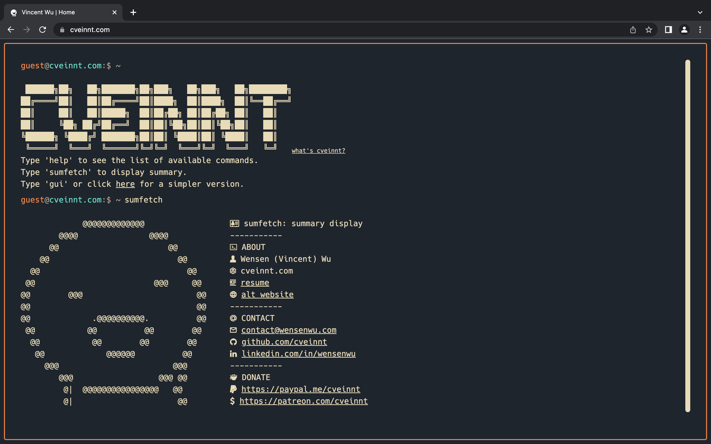

# [💻 LiveTerm - build terminal styled websites in minutes!](https://liveterm.vercel.app)

## 📸 Showcase

<p align="center">
<br>
<strong>LiveTerm with different themes</strong>
</p>

<p align="center">
<br>
<strong><a href="https://cveinnt.com" target=_blank>my personal website</a></strong>
</p>

## 📄 Configuration

### Basic Configuration

90% of LiveTerm's configurations are done through the `config.json` file.

```javascript
{
  "readmeUrl": // create a Github README and link it here!
  "title": // title of the website
  "name": // your name, included in 'about' command
  "ascii": // ascii art to display
  "social": {
    "github": // your handle
    "linkedin": // your handle
  },
  "email": // your email
  "ps1_hostname": "liveterm" // hostname in prompt
  "ps1_username": "visitor", // username in prompt
  "resume_url": "../resume.pdf", // path to your resume
  "non_terminal_url": "W",
  "colors": {
    "light": {
      ...
    },
    "dark": {
      ... // you can use existing templates in themes.json or use your own!
    }
  }
}
```

Feel free to change it as you see fit!

### Themes

You can find several pre-configured themes in `themes.json`, and you can replace the colors in `config.json` with the theme color you like! The themes are based on the themes on [this website](https://glitchbone.github.io/vscode-base16-term/#/).

For a better preview of the themes, checkout the images in the `demo` folder.

### Favicons

Favicons are located in `public/`, along with the other files you may want to upload to your website. I used this [website](https://www.favicon-generator.org/) to generate favicons.

### Banner

You may also want to change the output of the `banner` command. To do that, simply paste your generated banner in `src/utils/bin/commands.ts`. I used this [website](https://manytools.org/hacker-tools/ascii-banner/) to generate my banner.

### Advanced Configuration

If you want to further customize your page, feel free to change the source code to your liking!

## Credit

Based on M4TT72's awesome [Terminal](https://github.com/m4tt72/terminal).
